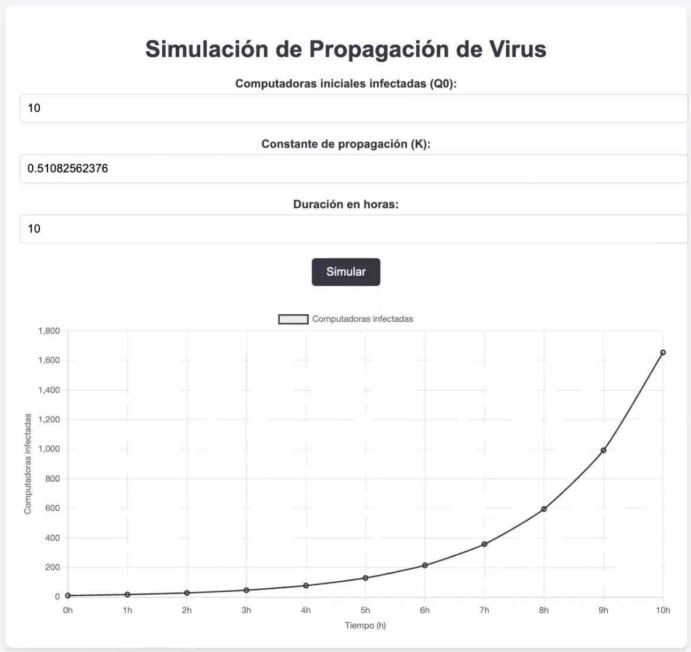

# Simulador de Propagación de Virus en Redes Informáticas

Este proyecto es un simulador interactivo que muestra cómo se propaga un virus en una red informática utilizando una función exponencial. Se diseñó para visualizar de manera sencilla el comportamiento de la propagación y cómo varía en función del número inicial de computadoras infectadas, la constante de propagación, y el tiempo.

---

## 📋 Contenido

- [Descripción](#-descripción)
- [Características](#-características)
- [Requisitos](#-requisitos)
- [Instrucciones de Uso](#-instrucciones-de-uso)
- [Estructura del Proyecto](#-estructura-del-proyecto)
- [Visualización](#-visualización)
- [Licencia](#-licencia)

---

## 💡 Descripción

El simulador utiliza la ecuación exponencial:  
\[
Q(t) = Q_0 \cdot e^{K \cdot t}
\]  

Donde:  
- \( Q_0 \): Número inicial de computadoras infectadas.  
- \( K \): Constante de propagación.  
- \( t \): Tiempo en horas.  

Los resultados se representan en un gráfico interactivo generado con la biblioteca [Chart.js](https://www.chartjs.org/), permitiendo explorar el impacto de diferentes valores de entrada.

---

## ✨ Características

- Interfaz sencilla e intuitiva para ingresar parámetros.
- Gráfico interactivo que muestra la propagación en tiempo real.
- Uso de estilos modernos con diseño responsivo.
- Función para ajustar valores y simular nuevamente.

---

## ⚙️ Requisitos

- Navegador web moderno (Google Chrome, Firefox, Edge, Safari).
- Conexión a Internet para cargar la biblioteca externa [Chart.js](https://www.chartjs.org/).

---

## 🚀 Instrucciones de Uso

1. **Abrir el archivo**: Descarga el archivo `index.html` y ábrelo en tu navegador.  
2. **Ingresar los parámetros**:
   - **Computadoras iniciales infectadas (Q0):** Número de equipos infectados al inicio.
   - **Constante de propagación (K):** Representa la velocidad de propagación del virus.
   - **Duración en horas:** Tiempo que quieres simular.  
3. **Ejecutar la simulación**: Haz clic en el botón **"Simular"**.  
4. **Analizar el gráfico**: Observa el número de computadoras infectadas a lo largo del tiempo.  

---

## 📂 Estructura del Proyecto

El proyecto consta de un solo archivo HTML que incluye:  

- **HTML**: Contiene la estructura de la interfaz de usuario.  
- **CSS**: Incluye estilos básicos para la página.  
- **JavaScript**: Gestiona la lógica de simulación y la generación del gráfico.  

---

## 📊 Visualización

A continuación, se muestra un ejemplo de simulación generado por este proyecto:

   

---

### 🎉 ¡Gracias por usar el Simulador de Propagación de Virus!  
Si tienes alguna sugerencia o encuentras algún problema, no dudes en contribuir o dejar tu feedback. 🚀
